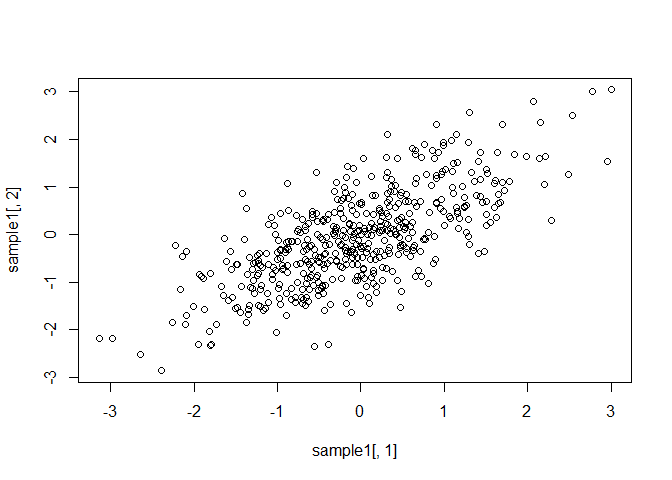

<!-- README.md is generated from README.Rmd. Please edit that file -->

# Fast Sampling from Multivariate Normal distribution with Toeplitz-structured covariance matrix (MVToep)

<!-- badges: start -->

[](https://github.com/JaeHoanKim/MVToep/actions/workflows/R-CMD-check.yaml)
[](https://codecov.io/gh/JaeHoanKim/MVToep?branch=master)

<!-- badges: end -->

## Intended use

Multivariate normal (Gaussian) sampling from the Toeplitz-structured
covariance matrix is in diverse fields: from obtaining the approximate
solution of the stochastic partial differential equation (see \[1\]) to
directly testing the performance in the simulation studies (see \[2\]).
Therefore, this package intends to efficiently draw samples from the
Toeplitz-structured covariance matrix, with several user-friendly
functions. For handy usage, it provides simple implementations for
sampling from the regular grid points with radial basis function (RBF)
and Matern kernels, with the covariance matrix of the autoregressive
model. The main idea for this algorithm is suggested on \[3\].

## Installation

You can install the development version of MVToep package by:

``` r
# install.packages("devtools")
devtools::install_github("JaeHoanKim/MVToep")
```

Then, use

    library(MVToep)

## Example

This is a basic example which shows how to use `rmvToep` function:

``` r
library(MVToep)

Sigma = Sigma.AR.order(0.7, 200, order = 5)
print(Sigma[1:8, 1:8])
#>         [,1]    [,2]    [,3]   [,4]   [,5]    [,6]    [,7]    [,8]
#> [1,] 1.00000 0.70000 0.49000 0.3430 0.2401 0.16807 0.00000 0.00000
#> [2,] 0.70000 1.00000 0.70000 0.4900 0.3430 0.24010 0.16807 0.00000
#> [3,] 0.49000 0.70000 1.00000 0.7000 0.4900 0.34300 0.24010 0.16807
#> [4,] 0.34300 0.49000 0.70000 1.0000 0.7000 0.49000 0.34300 0.24010
#> [5,] 0.24010 0.34300 0.49000 0.7000 1.0000 0.70000 0.49000 0.34300
#> [6,] 0.16807 0.24010 0.34300 0.4900 0.7000 1.00000 0.70000 0.49000
#> [7,] 0.00000 0.16807 0.24010 0.3430 0.4900 0.70000 1.00000 0.70000
#> [8,] 0.00000 0.00000 0.16807 0.2401 0.3430 0.49000 0.70000 1.00000
sample1 = rmvToep(500, Sigma)
plot(sample1[, 1], sample1[, 2])
```



``` r
(cor(sample1[, 1], sample1[, 2]))
#> [1] 0.7032641
```

To use `rmvToep` function, a symmetric and Toeplitz-structured
covariance matrix should be provided. `mvToep` package provides one
class of covariance matrix which satisfies these conditions in
`Sigma.AR.order` function, which is the covariance matrix of
autoregressive (AR) model. One can control the number of nonzero
elements in this matrix by changing `order` argument. Simply saying,
this argument indicates the nonzero bandwidth of the matrix. Under the
AR model, the corrrelation coefficient of neighborhood is known to be
`rho`, which is matched with the above result.

``` r
plot(sample1[, 1], sample1[, 21])
```


``` r
(cor(sample1[, 1], sample1[, 21]))
#> [1] 0.04555786
```

In contrast, two indexes located far from each other show negligable
correlation.

## References

-   Lindgren, Finn, Håvard Rue, and Johan Lindström. “An explicit link
    between Gaussian fields and Gaussian Markov random fields: the
    stochastic partial differential equation approach.” Journal of the
    Royal Statistical Society: Series B (Statistical Methodology) 73.4
    (2011): 423-498.

-   Kim, Jaehoan, Hoyoung Park, and Junyong Park. “High dimensional
    discriminant rules with shrinkage estimators of covariance matrix
    and mean vector.” arXiv preprint arXiv:2211.15063 (2022).

-   Wood, Andrew TA, and Grace Chan. “Simulation of stationary Gaussian
    processes in \[0, 1\]^d.” Journal of computational and graphical
    statistics 3.4 (1994): 409-432.
